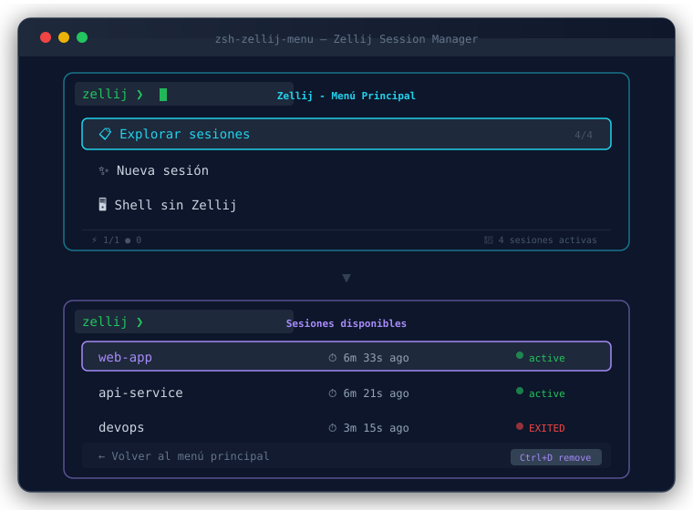

# zsh-zellij-menu — Interactive Zellij Session Manager for Zsh

[](https://github.com/MoriNo23/zsh-zellij-menu/actions/workflows/ci.yml)
[](https://opensource.org/licenses/MIT)

> A 2-level fzf-based TUI for managing Zellij sessions with session name parsing, status display, and Warp terminal detection.

<p align="center">
  
</p>

[English](#english) | [Español](#español)

---

## English

### Features

- **2-level TUI**: Main menu → Session explorer with parsed session info
- **Session name parsing**: Correctly handles names with spaces (e.g., `web app`)
- **Status display**: Shows `⏱ time` and `active/EXITED` status for each session
- **Delete sessions**: Press `Ctrl+D` in the session explorer to kill a session (instant, no confirmation)
- **Warp terminal detection**: Auto-skips Zellij menu in Warp Terminal (2-layer detection: env vars + process tree walk)
- **AI-agent shell detection**: Skips the menu when an AI runtime (opencode, codex, claude, hermes...) opens its own shell with a PTY — prevents fzf from hanging on a human that isn't there. 3 layers: manual opt-out (`ZZM_AGENT_SKIP=1`), env vars, and ancestor walk (`ZZM_AGENT_BINS`).
- **No `exec` on attach**: If attach fails, you return to the menu instead of losing your terminal
- **Configurable**: Override icons, colors, and messages via variables

### Installation

```bash
git clone https://github.com/MoriNo23/zsh-zellij-menu ~/.zsh-zellij-menu
~/.zsh-zellij-menu/install.sh
```

Open a new terminal to activate.

### Manual Installation

```bash
git clone https://github.com/MoriNo23/zsh-zellij-menu ~/.zsh-zellij-menu
```

Add to `~/.zshenv` (NOT `.zshrc` — see note below):

```zsh
if [[ -o interactive && -z "$ZELLIJ" && -t 0 ]]; then
    source ~/.zsh-zellij-menu/lib/zzm_menu.zsh
    zzm_menu
fi
```

> **Why `.zshenv` and not `.zshrc`?** Kitty (and other terminals that inject
> `ZDOTDIR`) does not load `~/.zshrc` by default: kitty sets
> `ZDOTDIR=/usr/lib/kitty/shell-integration/zsh`, whose `.zshenv` sources your
> `~/.zshenv` but **never** `~/.zshrc`. The auto-launch guard must live in the
> only startup file every shell reads. `.zshenv` is loaded in ALL shells, so
> the guard is gated on `-o interactive` (skip non-interactive/agent shells)
> plus the existing `-z "$ZELLIJ" && -t 0` checks.

You may also want `fpath=(~/.zsh-zellij-menu/lib $fpath)` in `.zshrc` for the
`zzm_menu` function to be callable manually.

### Usage

On a new terminal, the menu appears:

```
✨ Nueva sesión
📋 Explorar sesiones
🖥️  Shell sin Zellij
```

Selecting **📋 Explorar sesiones** shows:

```
web-app         ⏱ 6m ago        ● active
api-service     ⏱ 6m ago        ● active
devops          ⏱ 3m ago        📌 EXITED
← Volver al menú principal
```

### Session Management

Press **`Ctrl+D`** while hovering over a session to kill it instantly. The list reloads automatically.

### Configuration

Override defaults **before** calling `zzm_menu`:

```zsh
ZZM_ICON_NEW="🚀 New Session"
ZZM_ICON_EXPLORE="🔍 Browse Sessions"
ZZM_ICON_SHELL="🐚 Shell"
ZZM_FZF_HEIGHT="50%"
ZZM_FZF_BORDER="double"
ZZM_WARP_DETECTION=0  # disable Warp detection
ZZM_AGENT_SKIP=1      # force-skip even for unknown AI agents/tools
ZZM_AGENT_DETECTION=0 # disable AI-agent detection entirely
```

### Requirements

- zsh 5.0+
- fzf
- zellij

### License

MIT — see [LICENSE](LICENSE).

---

## Español 🇪🇸

### Características

- **TUI de 2 niveles**: Menú principal → Explorador de sesiones con información parseada
- **Parseo de nombres**: Maneja correctamente nombres con espacios (ej: `web app`)
- **Estado visual**: Muestra `⏱ tiempo` y estado `active/EXITED` para cada sesión
- **Eliminar sesiones**: Presioná `Ctrl+D` en el explorador para matar una sesión al instante
- **Detección de Warp**: Saltea el menú en Warp Terminal (detección 2 capas: env vars + process tree walk)
- **Detector de agentes IA/tools**: Saltea el menú cuando una IA (opencode, codex, claude, hermes...) abre su propia shell con PTY — evita que fzf se cuelgue esperando a un humano que no está. 3 capas: opt-out manual (`ZZM_AGENT_SKIP=1`), env vars, y walk de ancestros (`ZZM_AGENT_BINS`).
- **Sin `exec` en attach**: Si el attach falla, volvés al menú en vez de perder la terminal
- **Configurable**: Personalizá íconos, colores y mensajes

### Instalación

```bash
git clone https://github.com/MoriNo23/zsh-zellij-menu ~/.zsh-zellij-menu
~/.zsh-zellij-menu/install.sh
```

Abrí una terminal nueva para activar.

### Instalación manual

```bash
git clone https://github.com/MoriNo23/zsh-zellij-menu ~/.zsh-zellij-menu
```

Agregar a `.zshrc`:

```zsh
fpath=(~/.zsh-zellij-menu/lib $fpath)
autoload -Uz zzm_menu

# Auto-lanzar en terminal nueva (saltea en Zellij, en Warp y en shells de IA)
if [[ -z "$ZELLIJ" && -t 0 ]]; then zzm_menu; fi
```

### Uso

Al abrir una terminal, aparece el menú:

```
✨ Nueva sesión
📋 Explorar sesiones
🖥️  Shell sin Zellij
```

Seleccionando **📋 Explorar sesiones** se muestra:

```
web-app         ⏱ 6m ago        ● active
api-service     ⏱ 6m ago        ● active
devops          ⏱ 3m ago        📌 EXITED
← Volver al menú principal
```

### Gestión de sesiones

Presioná **`Ctrl+D`** sobre una sesión para matarla al instante. La lista se recarga automáticamente.

### Configuración

Podés sobreescribir los defaults **antes** de llamar `zzm_menu`:

```zsh
ZZM_ICON_NEW="🚀 Nueva sesión"
ZZM_ICON_EXPLORE="🔍 Explorar"
ZZM_ICON_SHELL="🐚 Shell"
ZZM_FZF_HEIGHT="50%"
ZZM_FZF_BORDER="double"
ZZM_WARP_DETECTION=0  # desactivar detección de Warp
```

### Requisitos

- zsh 5.0+
- fzf
- zellij

### Licencia

MIT — vea [LICENSE](LICENSE).
